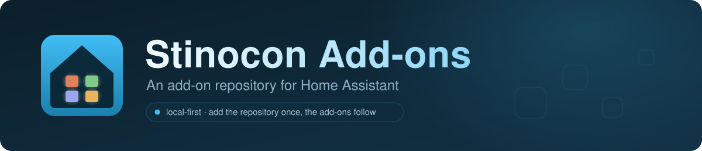

<p align="center">
  
</p>

# Home Assistant add-ons by Stinocon

Add-ons with nothing in common, kept in one repository because Home Assistant installs
add-ons from repositories rather than one at a time.

## Installation

In Home Assistant: **Settings → Add-ons → Add-on Store**, top-right menu, **Repositories**,
then add:

```
https://github.com/Stinocon/addons
```

Every add-on in this repository then appears in the store, including anything added later.
Install whichever you need: they are independent, and none requires another.

## The add-ons

| Add-on | What it does | Architectures | Version |
|---|---|---|---|
| **[iAlarm MQTT Bridge](ialarm-mqtt/)** | Bridges an iAlarm / Meian / Focus alarm panel to Home Assistant over MQTT, with clean entity naming and a working discovery | `amd64`, `aarch64` | see [`config.yaml`](ialarm-mqtt/config.yaml) |
| **[Reel2Recipe](reel2recipe/)** | Extracts recipes from cooking reels and exports them to Mela; Whisper and the LLM run inside the add-on | `amd64` only | see [`config.yaml`](reel2recipe/config.yaml) |

### iAlarm MQTT Bridge

Bridges iAlarm / Meian panels to Home Assistant over MQTT, with the entity-name flip-flop and
the HA 2024.2+ compliance bugs fixed, a distinct `ialarm-v2` prefix that keeps its entities
clear of any earlier bridge's, configurable arm modes and zone-ID indicators. The panel
accepts **one connection at a time**, so this add-on replaces any other iAlarm bridge rather
than running alongside it.

Enhancements over upstream were developed with AI assistance rather than hand-written by a
maintainer with deep knowledge of the codebase — they work for the maintainer's setup and are
tested as documented, but use them at your own risk.

Details, options and migration notes: **[`ialarm-mqtt/README.md`](ialarm-mqtt/README.md)** ·
[changelog](ialarm-mqtt/CHANGELOG.md) ·
[application source](https://github.com/Stinocon/ialarm-mqtt)

### Reel2Recipe

Transcribes a cooking reel, structures the recipe, converts quantities deterministically and
files it in a searchable library that exports to `.melarecipe`, Markdown or PDF. Whisper and
the LLM run **inside the container**: no API key, no subscription, no data leaving the
machine.

The cost of that choice is hardware: `amd64` only, 16 GB of RAM recommended, ~15 GB of disk,
and a few minutes of CPU per recipe. Read the requirements before installing — a Raspberry Pi
will not do.

Details and options: **[`reel2recipe/README.md`](reel2recipe/README.md)** ·
[changelog](reel2recipe/CHANGELOG.md) ·
[application source](https://github.com/Stinocon/Reel2Recipe)

## Repository layout

```
<slug>/          one directory per add-on, named after its slug:
                 config.yaml, build.yaml, Dockerfile, rootfs/, README.md, CHANGELOG.md, icons
                 README.md is English; a README.it.md beside it is the Italian version,
                 and the two are updated together or one of them starts lying
repository.json  what Home Assistant reads to list this repository
docs/brand/      the banner at the top of this README
.github/         one issue template and one publish workflow per add-on
```

Each add-on is self-contained: its version, supported architectures, published image and
documentation all live in its own directory, and nothing at the root needs editing to release
one of them — or to add another without disturbing what is already installed on someone's
machine.

## Releasing

Images are published to Docker Hub (`stfncntr/{arch}-addon-<slug>`) by a per-add-on workflow,
triggered by a **tag specific to that add-on** — never by a GitHub release, which in a
multi-add-on repository would rebuild the one that had nothing to do with it.

| Add-on | Tag | Workflow |
|---|---|---|
| `ialarm-mqtt` | `addon-v<version>` (e.g. `addon-v1.2.2`) | [`publish-ialarm-mqtt.yml`](.github/workflows/publish-ialarm-mqtt.yml) |
| `reel2recipe` | `reel2recipe-<version>` (e.g. `reel2recipe-1.0.0`) | [`publish-reel2recipe.yml`](.github/workflows/publish-reel2recipe.yml) |

The tag must be pushed **after** `config.yaml` carries the matching `version:` — the workflow
reads the version from `config.yaml`, not from the tag name, and tags the image with it.

Pull requests and pushes touching `ialarm-mqtt/` also get a no-push test build
([`test-ialarm-mqtt.yml`](.github/workflows/test-ialarm-mqtt.yml)), filtered by path so a
change to another add-on does not trigger it. `reel2recipe` has no equivalent: its image
bundles Ollama and pulls multi-gigabyte wheels, and building it on every push would spend far
more CI time than the check is worth.

## Adding another add-on

Four things, in this order:

1. **A directory named after the slug**, containing `config.yaml` (with
   `image: stfncntr/{arch}-addon-<slug>`), `build.yaml`, `Dockerfile`, `rootfs/`, `icon.png`,
   `logo.png`, its own `README.md` and `CHANGELOG.md`. Home Assistant finds add-ons by looking
   for directories with a `config.yaml`, so nothing needs to register it anywhere.
2. **A publish workflow**, copied from an existing one, with `ADDON_PATH` and the tag pattern
   changed. The pattern must not match any other add-on's tags.
3. **An issue template** in `.github/ISSUE_TEMPLATE/`, and a contact link in `config.yml`
   routing anything about the application itself to the repository where that code lives.
4. **A row in the add-ons table and in the release table above**, plus a short section under
   [The add-ons](#the-add-ons). Those two tables are the only places that list add-ons.

## Issues

Report an issue **where the code lives**, not where the packaging lives:

- Something wrong with installing, configuring or starting an add-on →
  [issues here](https://github.com/Stinocon/addons/issues).
- Something wrong with what an add-on *does* once running → the application repository, linked
  from that add-on's own README and from the issue templates.

## Licence

MIT — see [`LICENSE`](LICENSE). It covers everything in this repository: the packaging of
both add-ons, the workflows, the documentation and the artwork.

It does not cover the applications the add-ons install, which have their own authors and
licences — `ialarm-mqtt` is MIT, © 2019 Luca Mazzilli. [`NOTICE.md`](NOTICE.md) lists them,
because an image that ships someone else's software carries their notice with it.
